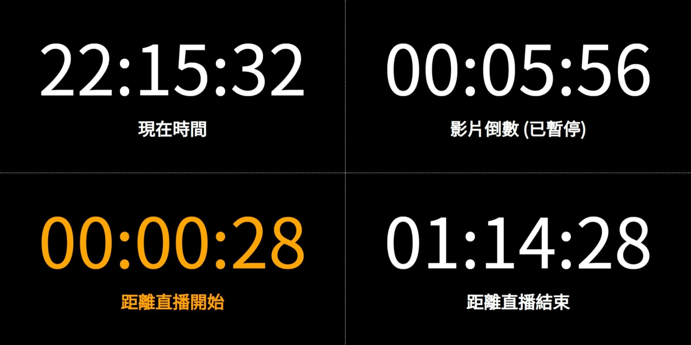
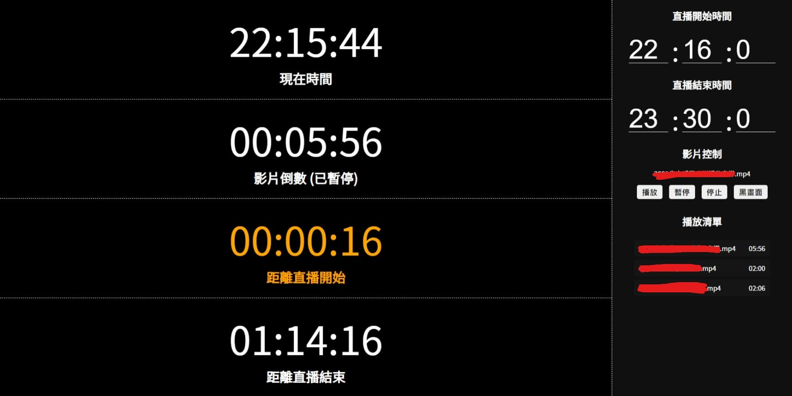

# ⏱️ LiveTimer
~~這是一個被學長壓榨的專案~~
#### **如果有學弟要用請記得案星星**

## 📖 使用教學
1. 先下載這坨檔案 `Code > Download ZIP`
2. 先去裝 [`NodeJS`](https://nodejs.org/zh-tw/)
3. 然後開個終端機切到這個目錄下面打 `npm i`
4. 然後打 `node server.js`

## 💻 模式
分別有四種計時模式
1. 現在的時間
2. 現在正在播的影片倒數
3. 距離直播開始
4. 距離直播結束

## 🌐 網頁路徑
- `/`: 輸出頁
- `/video.html`: 影片頁面
- `/admin.html`: 管理頁面

## 🖼️ 一些圖

## ❤️ 貢獻
 - [學長](https://github.com/lifeng-87): 製作了原始專案
 - [壓榨我的學長](https://github.com/lyuchan): 提出這個想法 + 壓榨我
 - [我](https://github.com/Gary50613): 這個專案